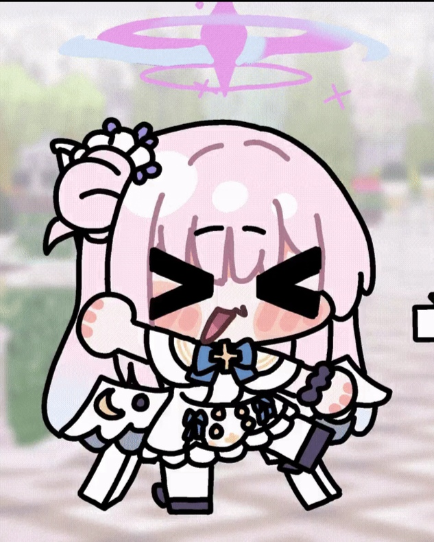

<p align="center">
  
</p>

<h1 align="center">LumiMate</h1>

<p align="center">
  A quiet spatial AI companion. 一个安静、会呼吸的桌面 AI 陪伴空间。
</p>

<p align="center">
  <a href="https://github.com/Nyzeep/LumiMate"></a>
  
  
  
  
  
  
  
  
</p>

## 项目信息 / Project Info

- 作者 / Author: `Nyzeep`
- 仓库 / Repository: `https://github.com/Nyzeep/LumiMate`
- 技术栈 / Stack: `Python + PySide6 + Qt WebEngine + Vue 3 + Vite`

LumiMate 是一个围绕“空间化陪伴体验”构建的桌面 AI 项目。Python 负责窗口、桥接、模型加载与本地服务；Vue 3 负责完整视觉界面、场景切换、动效系统与交互表达。

LumiMate is a desktop AI companion built around a spatial presence experience. Python owns the window, bridge, model loading, and local services; Vue 3 owns the visual interface, scene system, motion, and interaction layer.

## 功能亮点 / Highlights

- 九个沉浸式空间 / Nine immersive spaces: home, chat, companion, workbench, loading, storage, settings, personality, and about.
- WebEngine 混合架构 / Hybrid WebEngine runtime: native desktop shell with a modern web UI.
- QWebChannel 通信 / QWebChannel bridge: frontend requests are routed through Python instead of direct file IO.
- 几何星空视觉系统 / Geometric starry visual system: glass panels, thin SVG geometry, amber bloom, and slow breathing motion.
- 模型工作台 / Model workbench: model cards, structured status, loading feedback, and local resource management.
- 运行时动效层 / Runtime motion layer: ambient modes, reduced-motion support, and development diagnostics HUD.

## 快速开始 / Quick Start

创建虚拟环境并安装 Python 依赖：  
Create a virtual environment and install Python dependencies:

```powershell
python -m venv .venv
.\.venv\Scripts\python.exe -m pip install -r requirements.txt
```

构建前端：  
Build the frontend:

```powershell
cd ui\web
npm install
npm run build
cd ..\..
```

启动程序：  
Launch the app:

```bat
run_lumi.bat
```

开发时也可以使用窗口模式：  
Use windowed mode during development:

```powershell
.\.venv\Scripts\python.exe main.py --windowed
```

## 开发命令 / Development

```powershell
# Web frontend build
cd ui\web
npm run build

# WebEngine entry check
cd ..\..
.\.venv\Scripts\python.exe main.py --check

# Direct launch
.\.venv\Scripts\python.exe main.py
```

## 架构说明 / Architecture

```text
main.py       Desktop shell, WebEngine container, startup checks
ui/bridge/    PySide6 objects exposed to the frontend through QWebChannel
ui/web/       Vue 3 scenes, components, styles, and runtime UI engine
controllers/  Application orchestration and service calls
services/     Assistant runtime, model loading, and update flow
config/       Runtime defaults, app metadata, and user settings
resources/    Audio prompts and interface assets
背景图片/      Existing project background images
```

The current UI path is WebEngine-first. The legacy QML layer is kept as a frozen fallback and is not the primary interface.

当前主路径是 WebEngine 前端。旧 QML 层仅作为冻结的回退实现保留，不再作为主要界面演进方向。

## 资源要求 / Runtime Assets

完整语音与模型能力依赖本地运行资源，请确认以下目录或资产存在：  
Full voice and model features depend on local runtime assets. Make sure these resources are available:

- `models/`
- `GenieData/`
- required local ASR / LLM / TTS assets
- required precompiled `flash_attn` assets when your model stack needs them

这些大型运行时资源默认不会提交到仓库。  
These large runtime assets are not committed to the repository by default.

## 注意事项 / Notes

- 背景图使用项目内既有资源，不依赖外部下载路径。  
  Backgrounds are loaded from existing project assets, not external download paths.
- 前端只通过 QWebChannel 调用底层能力，不直接扫描路径或读写模型文件。  
  The frontend talks to backend capabilities through QWebChannel and does not directly scan paths or mutate model files.
- 更新清单地址和项目仓库地址是两个不同概念，避免把 GitHub 首页当作自动更新 manifest。  
  The update manifest URL and project repository URL are intentionally separate.
